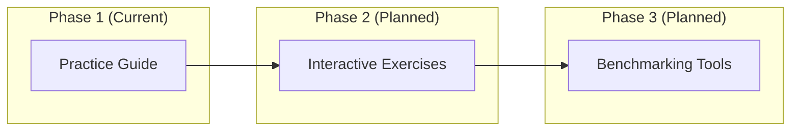
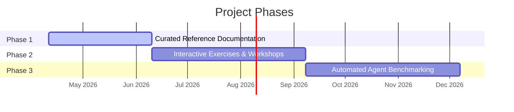

# Coding Agents Tooling

A comprehensive reference and practice guide for mastering coding agents — specifically **Claude Code** (Anthropic) and **OpenAI Codex CLI**. Covers every documented feature surface: architecture, CLI commands, hooks, skills, plugins, MCP, subagents, security, configuration, IDE integration, CI/CD, scheduling, and applied exercises.

**Target audience**: Senior engineers who use coding agents in daily workflows and want deep, comparative mastery of both platforms.

---

## Architecture



---

## Guide Contents

The primary deliverable is `coding-agents-practice-guide.md`, covering:

| # | Section | Description |
|---|---------|-------------|
| 1 | Architecture Overview | Agent loop, tool use, extension points |
| 2 | Installation & Authentication | Setup for both agents |
| 3 | CLI Commands & Flags | Complete flag reference |
| 4 | Interactive Mode & TUI | REPL and terminal UI features |
| 5 | Slash Commands | Built-in and custom commands |
| 6 | Permission & Approval Modes | Trust levels, auto-approve, sandboxing |
| 7 | Instruction Files | CLAUDE.md vs AGENTS.md conventions |
| 8 | Skills | Proactive protocol definitions |
| 9 | Hooks | Lifecycle event handlers |
| 10 | Plugins | Extending agent capabilities |
| 11 | MCP | Model Context Protocol servers |
| 12 | Subagents & Agent Teams | Multi-agent orchestration |
| 13 | Non-Interactive / Headless Mode | CI/CD and scripted usage |
| 14 | Sandboxing & Security | Isolation and safety mechanisms |
| 15 | Configuration Files | Settings hierarchy and format |
| 16 | IDE & Editor Integration | VS Code, JetBrains, others |
| 17 | CI/CD & GitHub Actions | Pipeline integration |
| 18 | Cloud & Web Surfaces | Browser-based interfaces |
| 19 | Scheduling & Automation | Cron, triggers, recurring tasks |
| 20 | Models & Effort Levels | Model selection and reasoning effort |
| 21 | Context Window Management | Token budgets and compaction |
| 22 | Checkpointing & Session Management | Session persistence and recovery |
| 23 | Agent SDK | Programmatic agent control |
| 24 | Channels & External Events | External trigger mechanisms |
| 25 | Enterprise & Governance | Admin controls, audit, compliance |
| 26 | Practice Exercises | Applied exercises per section |
| 27 | Cross-Reference Matrix | Feature mapping across agents |

---

## How to Use

1. **Read the guide**: Open `coding-agents-practice-guide.md` in any markdown viewer that supports Mermaid diagrams (GitHub, GitLab, VS Code with Mermaid extension, etc.).
2. **Use as reference**: Jump to specific sections via the table of contents when you need details on a particular feature.
3. **Practice**: Work through the exercises at the end of each section and the consolidated exercises in Section 26.
4. **Compare**: Use the comparative tables to understand how the same concept maps across both agents.

---

## Phase Roadmap



| Phase | Deliverable | Status |
|-------|-------------|--------|
| 1 | Comprehensive markdown guide | **Active** |
| 2 | Interactive Jupyter/Streamlit exercises | Planned |
| 3 | Python CLI benchmarking tools | Planned |

---

## Project Structure

```
coding-agents-tooling/
├── CLAUDE.md                              # AI session guidelines
├── README.md                              # This file
├── coding-agents-practice-guide.md        # The guide (primary deliverable)
├── docs/
│   ├── CODING_AGENTS_TOOLING_MASTER_PLAN.md
│   ├── status.md
│   └── versions.md
├── .claude/                               # Claude Code configuration
│   ├── settings.json
│   ├── commands/
│   └── skills/
└── .gitignore
```