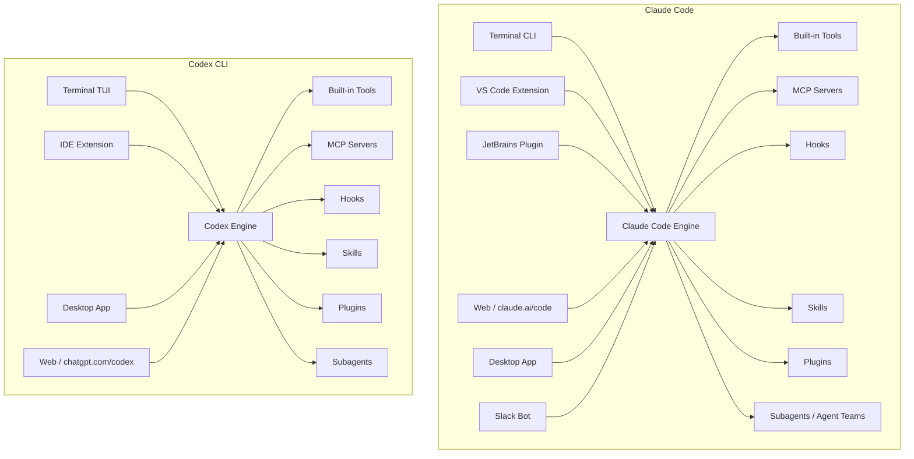
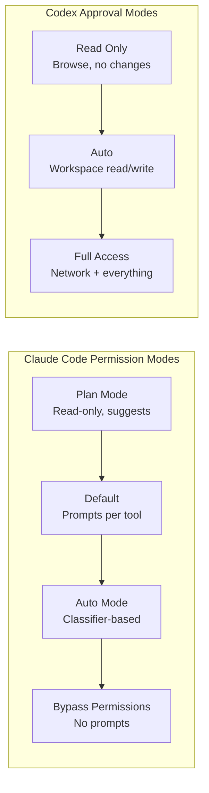
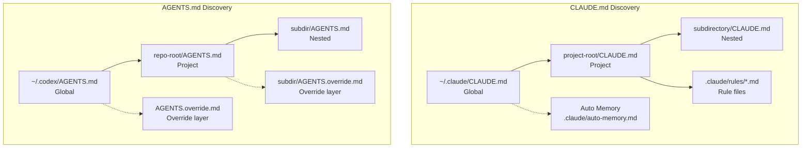
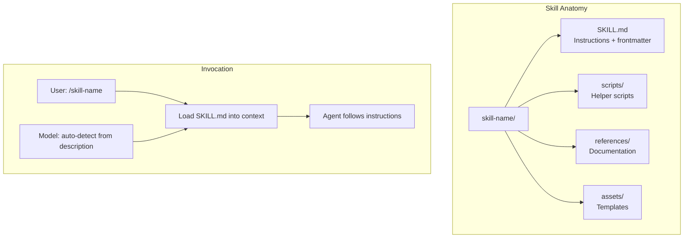
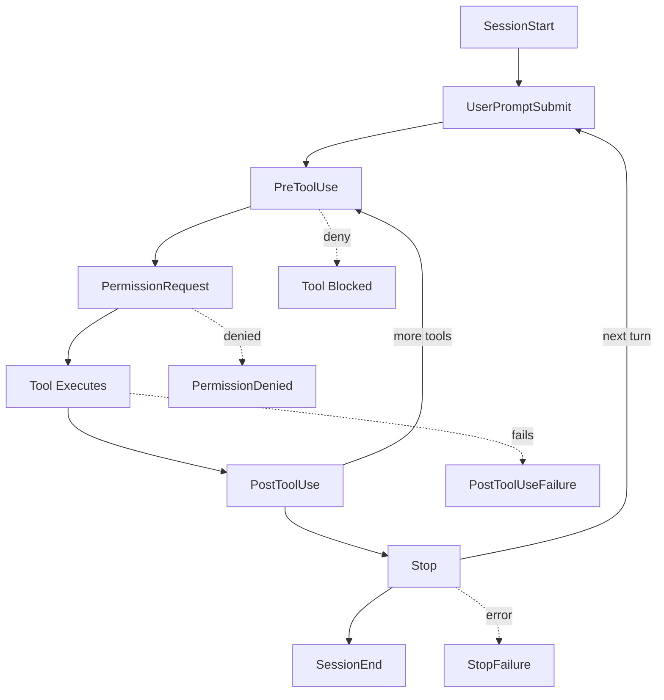
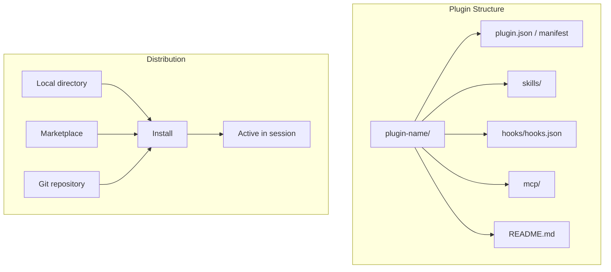
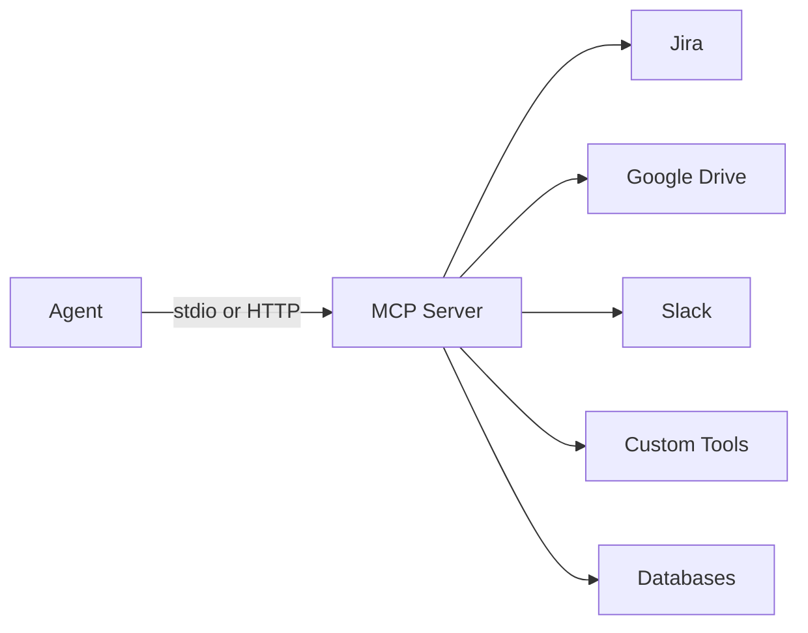
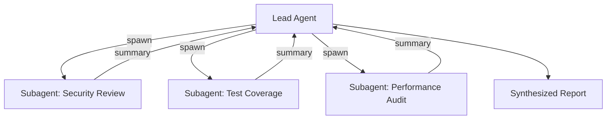
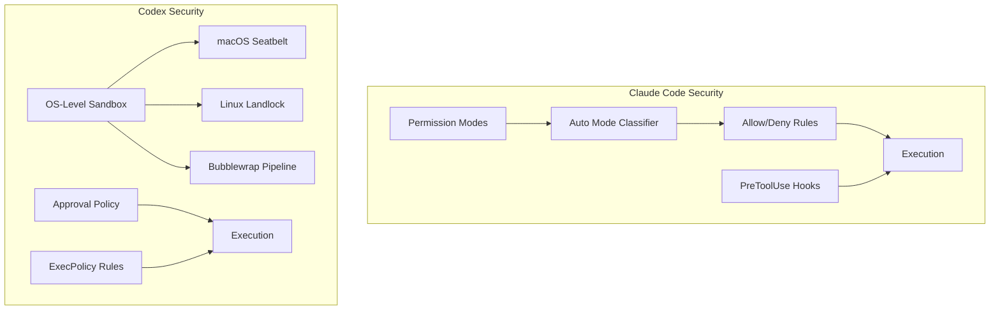
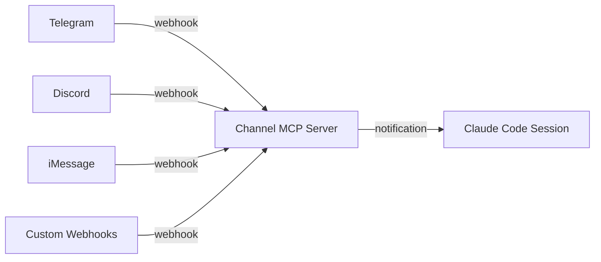

# Coding Agent Mastery: Claude Code & OpenAI Codex CLI

> A comprehensive practice guide covering every documented feature, command, hook, plugin, skill, and configuration surface for both agents — with comparative tables, architecture diagrams, and applied exercises.

---

## Table of Contents

1. [Architecture Overview](#1-architecture-overview)
2. [Installation & Authentication](#2-installation--authentication)
3. [CLI Commands & Flags](#3-cli-commands--flags)
4. [Interactive Mode & TUI](#4-interactive-mode--tui)
5. [Slash Commands](#5-slash-commands)
6. [Permission & Approval Modes](#6-permission--approval-modes)
7. [Instruction Files: CLAUDE.md vs AGENTS.md](#7-instruction-files-claudemd-vs-agentsmd)
8. [Skills](#8-skills)
9. [Hooks](#9-hooks)
10. [Plugins](#10-plugins)
11. [MCP (Model Context Protocol)](#11-mcp-model-context-protocol)
12. [Subagents & Agent Teams](#12-subagents--agent-teams)
13. [Non-Interactive / Headless Mode](#13-non-interactive--headless-mode)
14. [Sandboxing & Security](#14-sandboxing--security)
15. [Configuration Files](#15-configuration-files)
16. [IDE & Editor Integration](#16-ide--editor-integration)
17. [CI/CD & GitHub Actions](#17-cicd--github-actions)
18. [Cloud & Web Surfaces](#18-cloud--web-surfaces)
19. [Scheduling & Automation](#19-scheduling--automation)
20. [Models & Effort Levels](#20-models--effort-levels)
21. [Context Window Management](#21-context-window-management)
22. [Checkpointing & Session Management](#22-checkpointing--session-management)
23. [Agent SDK](#23-agent-sdk)
24. [Channels & External Events](#24-channels--external-events)
25. [Enterprise & Governance](#25-enterprise--governance)
26. [Practice Exercises](#26-practice-exercises)
27. [Cross-Reference Matrix](#27-cross-reference-matrix)

---

## 1. Architecture Overview

Both agents follow a similar conceptual loop: read context → plan → use tools → iterate. The key differences are in where they run, how they sandbox, and how they extend.



### Conceptual Comparison

| Dimension | Claude Code | Codex CLI |
|---|---|---|
| Creator | Anthropic | OpenAI |
| Language | TypeScript/Node.js | Rust |
| Default Model | Claude Sonnet 4.6 / Opus 4.6 | GPT-5.4 / GPT-5.3-Codex |
| Instruction File | `CLAUDE.md` | `AGENTS.md` |
| Config Format | JSON (`settings.json`) | TOML (`config.toml`) |
| Config Location | `~/.claude/` + `.claude/` | `~/.codex/` + `.codex/` (or `.agents/`) |
| Sandbox Tech | Permission modes + auto mode classifier | OS-level: macOS Seatbelt, Linux Landlock/bubblewrap |
| Open Source | Yes (GitHub) | Yes (GitHub) |
| Auto-Update | Native install: yes | No (manual `npm` or `brew` upgrade) |

---

## 2. Installation & Authentication

### Claude Code

```bash
# Native install (recommended, auto-updates)
curl -fsSL https://claude.ai/install.sh | bash       # macOS/Linux/WSL
irm https://claude.ai/install.ps1 | iex              # Windows PowerShell

# Homebrew
brew install --cask claude-code           # stable
brew install --cask claude-code@latest    # bleeding edge

# WinGet
winget install Anthropic.ClaudeCode

# Start
cd your-project && claude

# Auth
claude auth login             # browser OAuth
claude auth login --console   # API key via Console
claude auth logout
claude auth status
```

### Codex CLI

```bash
# npm (global)
npm i -g @openai/codex

# Homebrew
brew install --cask codex

# Start
codex

# Auth
codex auth login      # ChatGPT OAuth or API key
codex auth logout
# or: export OPENAI_API_KEY="sk-..."
```

### Authentication Comparison

| Feature | Claude Code | Codex CLI |
|---|---|---|
| Browser OAuth | Yes | Yes (ChatGPT) |
| API Key | Yes (Console) | Yes (`OPENAI_API_KEY`) |
| SSO | `--sso` flag | Via ChatGPT Enterprise |
| Long-lived token | `claude setup-token` | API key |
| Device auth | No | Yes |

---

## 3. CLI Commands & Flags

### Claude Code Commands

| Command | Purpose |
|---|---|
| `claude` | Start interactive session |
| `claude "query"` | Start with initial prompt |
| `claude -p "query"` | Print mode (non-interactive, exits after) |
| `claude -c` | Continue most recent conversation |
| `claude -r "session" "query"` | Resume a named/ID session |
| `claude update` | Update to latest version |
| `claude auth login/logout/status` | Manage authentication |
| `claude agents` | List configured subagents |
| `claude auto-mode defaults` | Print auto mode classifier rules |
| `claude mcp` | Configure MCP servers |
| `claude plugin install/list/remove` | Manage plugins |
| `claude remote-control` | Start Remote Control server |
| `claude setup-token` | Generate long-lived OAuth token |

### Claude Code Key Flags

| Flag | Purpose |
|---|---|
| `--add-dir` | Add additional working directories |
| `--agent` | Specify agent for session |
| `--allowedTools` | Pre-approve tools |
| `--append-system-prompt` | Add to system prompt |
| `--bare` | Minimal mode, skip auto-discovery |
| `--chrome` | Enable Chrome integration |
| `--dangerously-skip-permissions` | Bypass all permission checks |
| `--effort low|medium|high|max` | Set reasoning effort |
| `--fallback-model` | Automatic model fallback |
| `--json-schema` | Structured output validation |
| `--max-budget-usd` | Spend cap |
| `--max-turns` | Turn limit |
| `--mcp-config` | Load MCP from file |
| `--model` | Override model |
| `--name` / `-n` | Name the session |
| `--no-session-persistence` | Ephemeral session |
| `--output-format text|json|stream-json` | Output format |
| `--permission-mode` | Set permission mode |
| `--print` / `-p` | Non-interactive print mode |
| `--resume` / `-r` | Resume session |
| `--tools` | Restrict available tools |

### Codex CLI Commands

| Command | Purpose |
|---|---|
| `codex` | Start interactive TUI |
| `codex "prompt"` | Start with initial prompt |
| `codex exec "prompt"` | Non-interactive execution |
| `codex app` | Launch desktop app |
| `codex apply` | Apply diff from cloud task |
| `codex cloud` / `codex cloud exec` | Manage cloud tasks |
| `codex auth login/logout` | Authentication |
| `codex mcp list|add|remove` | Manage MCP servers |
| `codex mcp` (as server) | Run Codex as MCP server |
| `codex resume [id]` | Resume previous session |
| `codex fork` | Fork a session into new thread |
| `codex features list|enable|disable` | Manage feature flags |
| `codex eval` | Evaluate exec-policy rules |
| `codex sandbox` | Run commands in sandbox |
| `codex app-server` | Launch local app server |

### Codex CLI Key Flags

| Flag | Purpose |
|---|---|
| `--ask-for-approval` | Set approval policy |
| `--sandbox` | Set sandbox policy |
| `--full-auto` | Auto approval + workspace-write sandbox |
| `--model` / `-m` | Override model |
| `--image` / `-i` | Attach images |
| `--cwd` | Set working directory |
| `--search` | Enable live web search |
| `--oss` | Use local open-source model via Ollama |
| `--include` | Attach file context |
| `--output json` | JSON output |
| `--no-alternate-screen` | Disable TUI alternate screen |
| `--yolo` | Skip all approvals and sandboxing |
| `--profile` | Load config profile |
| `-c key=value` | Override config inline |
| `--writable-root` | Grant additional write directories |

---

## 4. Interactive Mode & TUI

### Claude Code Interactive Features

| Feature | How |
|---|---|
| Multi-line input | `\` at end of line or paste |
| Cancel response | `Escape` |
| Cycle permission modes | `Shift+Tab` |
| File mentions | `@filename` (VS Code) |
| Image paste | Paste from clipboard |
| Pipe to stdin | `cat file \| claude -p` |
| Clear conversation | `/clear` |
| Compact context | `/compact` |
| Switch model | `/model` |

### Codex CLI Interactive Features

| Feature | How |
|---|---|
| File mentions | `@` then fuzzy search |
| Image attachments | `--image` flag or paste |
| Inject mid-turn | Press `Enter` while running |
| Queue follow-up | Press `Tab` while running |
| Shell escape | `!command` prefix |
| Theme picker | `/theme` |
| Clear chat | `/clear` (new conversation) |
| Clear screen only | `Ctrl+L` |
| Copy output | `/copy` |

---

## 5. Slash Commands

### Claude Code Slash Commands

| Command | Type | Purpose |
|---|---|---|
| `/help` | Built-in | Show help |
| `/compact` | Built-in | Compact context window |
| `/clear` | Built-in | Clear conversation |
| `/model` | Built-in | Switch model |
| `/cost` | Built-in | Show token costs |
| `/resume` | Built-in | Resume a past session |
| `/rename` | Built-in | Rename session |
| `/context` | Built-in | Inspect context window |
| `/hooks` | Built-in | View/toggle hooks |
| `/desktop` | Built-in | Hand off to Desktop app |
| `/loop` | Skill | Repeat prompt on schedule |
| `/debug` | Skill | Debug workflow |
| `/simplify` | Skill | Simplify code |
| `/batch` | Skill | Batch operations |
| `/claude-api` | Skill | Build with Claude API |
| `/schedule` | Built-in | Create cloud scheduled task |
| `/security-review` | Built-in | Security review |
| `/rewind` | Built-in | Undo code changes |
| `/skill-name` | Custom | User-defined skills |

### Codex CLI Slash Commands

| Command | Purpose |
|---|---|
| `/model` | Switch model mid-session |
| `/fast on|off|status` | Toggle fast mode |
| `/personality` | Change communication style |
| `/permissions` | Switch approval mode |
| `/plan` | Enter plan mode |
| `/review` | Code review |
| `/fork` | Fork current session |
| `/clear` | New conversation |
| `/copy` | Copy latest output |
| `/status` | Show active config |
| `/debug-config` | Show config layer order |
| `/experimental` | Toggle experimental features |
| `/theme` | Theme picker |
| `/quit` / `/exit` | Exit |
| `/agent` | Inspect/switch subagent threads |
| `/skills` | List/invoke skills |
| `/statusline` | Toggle status-line items |
| `/sandbox-add-read-dir` | Grant sandbox read access (Windows) |

---

## 6. Permission & Approval Modes



| Aspect | Claude Code | Codex CLI |
|---|---|---|
| Read-only | Plan mode | Read Only (`-s read-only`) |
| Default | Prompts per action | Auto (workspace read/write) |
| Autonomous | Auto mode (classifier rules) | Full Access (`-s danger-full-access`) |
| Skip everything | `--dangerously-skip-permissions` | `--yolo` |
| Mid-session switch | `Shift+Tab` | `/permissions` |
| Custom rules | `allowedTools` / `disallowedTools` in settings | `execpolicy` rule files |
| Auto mode classifier | Built-in, customizable via `auto-mode defaults` | N/A (uses sandbox + approval policy) |

---

## 7. Instruction Files: CLAUDE.md vs AGENTS.md

Both agents read markdown instruction files before starting work. They serve identical purposes but have different discovery mechanics.



| Feature | CLAUDE.md | AGENTS.md |
|---|---|---|
| Global location | `~/.claude/CLAUDE.md` | `~/.codex/AGENTS.md` |
| Project location | `./CLAUDE.md` | `./AGENTS.md` |
| Nested discovery | Yes, walks subdirectories | Yes, walks to CWD |
| Override mechanism | `.claude/rules/*.md` files | `AGENTS.override.md` |
| Auto memory | `.claude/auto-memory.md` (auto-generated) | N/A |
| Size limit | No hard limit (context-managed) | `project_doc_max_bytes` (32 KiB default) |
| Fallback names | N/A | Configurable via `project_doc_fallback_filenames` |
| Include directives | `@path/to/file.md` syntax | N/A |
| Path-specific rules | `.claude/rules/*.md` with glob frontmatter | Override files in nested directories |
| Lazy loading | Yes, some rules load on file access | N/A |

### Practice: Write an Instruction File

```markdown
# CLAUDE.md (or AGENTS.md)

## Build & Test
- Run `npm test` before committing
- Use `pnpm` for package management

## Code Style
- TypeScript strict mode
- Prefer functional patterns
- Max function length: 30 lines

## Architecture
- Services in `src/services/`
- Shared types in `src/types/`
- No circular imports
```

---

## 8. Skills

Skills extend agent capabilities with reusable instruction bundles. Both agents now support the open [Agent Skills](https://agentskills.io) standard.



### Skill Locations

| Scope | Claude Code Path | Codex CLI Path |
|---|---|---|
| Personal | `~/.claude/skills/<name>/SKILL.md` | `~/.codex/skills/<name>/SKILL.md` |
| Project | `.claude/skills/<name>/SKILL.md` | `.agents/skills/<name>/SKILL.md` |
| Plugin-bundled | `<plugin>/skills/<name>/SKILL.md` | `<plugin>/skills/<name>/SKILL.md` |
| Enterprise | Managed settings | Admin-distributed |

### Skill Frontmatter Fields

| Field | Claude Code | Codex CLI | Purpose |
|---|---|---|---|
| `name` | Yes | Yes (required) | Slash command name |
| `description` | Recommended | Required | When to invoke |
| `disable-model-invocation` | Yes | Via `agents/openai.yaml` | User-only invocation |
| `user-invocable` | Yes | Via `agents/openai.yaml` | Model-only invocation |
| `allowed-tools` | Yes | Via `agents/openai.yaml` | Pre-approve tools |
| `context` | `fork` (subagent) | N/A | Run in subagent |
| `agent` | Yes | N/A | Specify subagent type |
| `effort` | Yes | N/A | Override effort level |
| `model` | Yes | N/A | Override model |
| `paths` | Yes (glob patterns) | N/A | File-pattern activation |
| `shell` | `bash` or `powershell` | N/A | Shell for inline commands |
| `hooks` | Yes | N/A | Lifecycle hooks scoped to skill |
| `argument-hint` | Yes | N/A | Autocomplete hint |

### String Substitutions (Claude Code)

| Variable | Expands To |
|---|---|
| `$ARGUMENTS` | All arguments passed to skill |
| `$ARGUMENTS[N]` / `$N` | Nth argument (0-indexed) |
| `${CLAUDE_SESSION_ID}` | Current session ID |
| `${CLAUDE_SKILL_DIR}` | Directory containing SKILL.md |

### Practice: Create a Skill

```markdown
# ~/.claude/skills/review-pr/SKILL.md  (or ~/.codex/skills/review-pr/SKILL.md)
---
name: review-pr
description: Reviews the current PR for security, test coverage, and style
allowed-tools: Bash Read Grep
---

Review the current PR:

1. Run `git diff main...HEAD` to get the diff
2. Check for security issues (SQL injection, XSS, secrets)
3. Verify test coverage for changed files
4. Check style conformance against project standards
5. Summarize findings with severity ratings
```

---

## 9. Hooks

Hooks inject custom logic at specific points in the agentic loop. Both agents support them, but with different event sets and configuration formats.



### Hook Events Comparison

| Event | Claude Code | Codex CLI |
|---|---|---|
| Session start | `SessionStart` | N/A |
| User prompt submitted | `UserPromptSubmit` | `UserPromptSubmit` |
| Before tool use | `PreToolUse` | `PreToolUse` |
| Permission request | `PermissionRequest` | N/A |
| Permission denied | `PermissionDenied` | N/A |
| After tool use (success) | `PostToolUse` | `PostToolUse` |
| After tool use (failure) | `PostToolUseFailure` | N/A |
| Turn complete | `Stop` | `Stop` |
| Turn error | `StopFailure` | N/A |
| Subagent start | `SubagentStart` | N/A |
| Subagent stop | `SubagentStop` | N/A |
| Task created | `TaskCreated` | N/A |
| Task completed | `TaskCompleted` | N/A |
| Teammate idle | `TeammateIdle` | N/A |
| Notification | `Notification` | N/A |
| Instructions loaded | `InstructionsLoaded` | N/A |
| Config change | `ConfigChange` | N/A |
| CWD changed | `CwdChanged` | N/A |
| File changed | `FileChanged` | N/A |
| Worktree create/remove | `WorktreeCreate` / `WorktreeRemove` | N/A |
| Pre/post compaction | `PreCompact` / `PostCompact` | N/A |
| MCP elicitation | `Elicitation` / `ElicitationResult` | N/A |
| Session end | `SessionEnd` | N/A |

### Configuration Format

**Claude Code** — JSON in `settings.json` or `hooks/hooks.json`:

```json
{
  "hooks": {
    "PreToolUse": [
      {
        "matcher": "Bash",
        "hooks": [
          {
            "type": "command",
            "if": "Bash(rm *)",
            "command": ".claude/hooks/block-rm.sh"
          }
        ]
      }
    ]
  }
}
```

**Codex CLI** — JSON in `hooks.json` next to config layers:

```json
{
  "hooks": {
    "PreToolUse": [
      {
        "matcher": "shell",
        "hooks": [
          {
            "type": "command",
            "command": ".codex/hooks/validate.sh"
          }
        ]
      }
    ]
  }
}
```

### Hook Handler Types (Claude Code)

| Type | Description |
|---|---|
| `command` | Shell command, receives JSON on stdin |
| `http` | HTTP POST endpoint |
| `prompt` | LLM prompt evaluated for decision |
| `agent` | Agent-based hook |

### Hook Decision Control

Hooks can return JSON to influence agent behavior:

| Decision | Effect |
|---|---|
| Exit code 0 | Allow / no-op |
| Exit code 1 | Error (block and report) |
| Exit code 2 | Event-specific (block, skip, retry) |
| `permissionDecision: "allow"` | Auto-approve tool call |
| `permissionDecision: "deny"` | Block tool call |
| `addToConversation` | Inject text into context |
| `suppressOutput` | Hide hook output from model |

### Practice: Write a PostToolUse Hook

```bash
#!/bin/bash
# .claude/hooks/auto-lint.sh — runs after every file edit
INPUT=$(cat)
TOOL=$(echo "$INPUT" | jq -r '.tool_name')
FILE=$(echo "$INPUT" | jq -r '.tool_input.file_path // empty')

if [[ "$TOOL" == "Edit" || "$TOOL" == "Write" ]] && [[ -n "$FILE" ]]; then
  npx eslint --fix "$FILE" 2>/dev/null
fi
exit 0
```

---

## 10. Plugins

Plugins bundle skills, hooks, MCP servers, and configuration into distributable packages.



| Feature | Claude Code | Codex CLI |
|---|---|---|
| Install command | `claude plugin install name@marketplace` | Config-based or marketplace |
| Plugin locations | Project `.claude/plugins/`, user `~/.claude/plugins/` | `.codex/plugins/`, `~/.codex/plugins/` |
| Contents | Skills, hooks, MCP configs, output styles | Skills, hooks, scripts, MCP configs |
| Marketplace | Plugin marketplace | Plugin marketplace |
| Managed (Enterprise) | `enabledPlugins` in managed settings | Admin config |
| Namespace | `plugin-name:skill-name` | `plugin-name:skill-name` |

---

## 11. MCP (Model Context Protocol)

MCP connects agents to external data sources and tools via a standardized protocol.



### MCP Configuration

**Claude Code** — via CLI or settings:

```bash
claude mcp add my-server -t stdio -- node /path/to/server.js
claude mcp add remote-server -t sse --url https://mcp.example.com/sse
claude mcp list
claude mcp remove my-server
```

Or in `.claude/settings.json`:

```json
{
  "mcpServers": {
    "memory": {
      "command": "npx",
      "args": ["-y", "@anthropic/mcp-memory"]
    }
  }
}
```

**Codex CLI** — in `~/.codex/config.toml`:

```toml
[mcp_servers.memory]
type = "stdio"
command = "npx"
args = ["-y", "@openai/mcp-memory"]
```

Or via CLI:

```bash
codex mcp add memory --type stdio -- npx -y @openai/mcp-memory
codex mcp list
codex mcp remove memory
```

### MCP Tool Naming

Both agents expose MCP tools with the pattern `mcp__<server>__<tool>`, allowing hooks and permissions to match on them.

### Running Agent as MCP Server

| Agent | Command |
|---|---|
| Claude Code | N/A (use Agent SDK) |
| Codex CLI | `codex mcp` (serves over stdio) |

---

## 12. Subagents & Agent Teams



| Feature | Claude Code | Codex CLI |
|---|---|---|
| Custom agents | `.claude/agents/<name>.md` frontmatter | `[agents]` in `config.toml` |
| Agent teams | Yes, lead + teammates | Yes, parallel subagents |
| Isolation | `isolation: "worktree"` (git worktree per agent) | Separate threads |
| Spawn trigger | Automatic or via agent prompt | Explicit user instruction only |
| Inter-agent comms | Task queue, shared filesystem | Shared filesystem, main thread |
| Model override | Per-agent `model` field | Per-agent config |
| Effort override | Per-agent `effort` field | Per-agent reasoning level |
| Preloaded skills | `skills` array in agent frontmatter | N/A |
| `--agents` flag | Dynamic JSON agent definition | N/A |
| `/agent` command | Inspect agent threads | Inspect/switch threads |

### Claude Code Agent Frontmatter

```markdown
---
name: security-reviewer
description: Reviews code for security vulnerabilities
model: claude-opus-4-6
effort: high
allowed-tools: Read Grep Bash
isolation: worktree
skills:
  - security-checklist
---

You are a security reviewer. Analyze code for:
1. Injection vulnerabilities
2. Authentication/authorization flaws
3. Secrets in code
4. Dependency vulnerabilities
```

### Codex Subagent Config (config.toml)

```toml
[agents.security]
model = "gpt-5.4"
instructions = "You are a security reviewer..."
```

---

## 13. Non-Interactive / Headless Mode

Both agents support scripted, non-interactive execution for CI/CD and automation.

| Feature | Claude Code | Codex CLI |
|---|---|---|
| Command | `claude -p "query"` | `codex exec "query"` |
| Pipe input | `cat file \| claude -p "query"` | `codex exec --include file "query"` |
| Output formats | `text`, `json`, `stream-json` | `text`, `json`, `jsonl` |
| Max turns | `--max-turns N` | N/A |
| Budget cap | `--max-budget-usd N` | N/A |
| Structured output | `--json-schema '{...}'` | N/A |
| Continue session | `claude -c -p "query"` | `codex exec --resume "query"` |
| Bare/fast start | `--bare` | N/A |
| Fallback model | `--fallback-model sonnet` | N/A |
| No persistence | `--no-session-persistence` | N/A |
| Full automation | `--dangerously-skip-permissions` | `--full-auto` or `--yolo` |

### Practice: Pipe & Script

```bash
# Claude Code: analyze logs
tail -200 app.log | claude -p "Find anomalies and summarize"

# Claude Code: structured output
claude -p --json-schema '{"type":"object","properties":{"bugs":{"type":"array"}}}' \
  "Find bugs in src/"

# Codex: automated test fix
codex exec --full-auto "Run tests and fix failures"

# Codex: non-interactive with file
codex exec --include data.csv "Analyze this CSV and report trends"
```

---

## 14. Sandboxing & Security



| Feature | Claude Code | Codex CLI |
|---|---|---|
| Sandbox technology | Application-level (permission classifier) | OS-level (Seatbelt/Landlock/bubblewrap) |
| Network blocking | Via permission rules | Default blocked in sandbox |
| File write scope | Configurable per tool | `workspace-write` (CWD only) by default |
| Custom exec rules | `allowedTools` / `disallowedTools` | `execpolicy` rule files |
| Sandbox test | N/A | `codex sandbox "command"` |
| Eval rules | N/A | `codex eval rules.json "command"` |

---

## 15. Configuration Files

### Claude Code Configuration Hierarchy

```
~/.claude/settings.json          # User global
.claude/settings.json            # Project (committable)
.claude/settings.local.json      # Project local (gitignored)
Managed policy settings          # Enterprise
```

### Codex CLI Configuration Hierarchy

```
~/.codex/config.toml             # User global
.codex/config.toml               # Project
Environment variables            # Runtime overrides
-c key=value flags               # Invocation overrides
```

### Key Config Fields

| Setting | Claude Code (JSON) | Codex CLI (TOML) |
|---|---|---|
| Model | `"model": "claude-sonnet-4-6"` | `model = "gpt-5.4"` |
| Approval mode | `"permissionMode": "auto"` | `approval_policy = "on-request"` |
| Sandbox | N/A | `sandbox_mode = "workspace-write"` |
| Allowed tools | `"allowedTools": ["Read", "Bash(git *)"]` | Via `execpolicy` files |
| MCP servers | `"mcpServers": {...}` | `[mcp_servers.name]` |
| Hooks | In settings or `hooks/hooks.json` | In `hooks.json` |
| Network access | Via tool permissions | `sandbox_workspace_write.network_access` |
| Max context bytes | N/A | `project_doc_max_bytes = 32768` |
| Web search | N/A | `web_search = "cached"` |
| Theme | N/A | `tui.theme = "monokai"` |

---

## 16. IDE & Editor Integration

| IDE | Claude Code | Codex CLI |
|---|---|---|
| VS Code | Native extension (inline diffs, @-mentions, plan review) | Extension (features, settings, commands) |
| Cursor | Same extension as VS Code | Same extension as VS Code |
| Windsurf | Same extension as VS Code | Same extension as VS Code |
| JetBrains | Plugin (IntelliJ, PyCharm, WebStorm) | Plugin |
| Neovim | N/A | N/A |
| Desktop App | Standalone app (macOS, Windows) | Standalone app (macOS) |

### VS Code Extension Features (Claude Code)

- Inline diff review
- `@file` mentions in chat
- Plan review mode
- Conversation history
- Side-by-side with terminal
- Drag-and-drop files/folders

---

## 17. CI/CD & GitHub Actions

### Claude Code

```yaml
# .github/workflows/claude-review.yml
name: Claude Code Review
on: [pull_request]
jobs:
  review:
    runs-on: ubuntu-latest
    steps:
      - uses: actions/checkout@v4
      - uses: anthropics/claude-code-action@v1
        with:
          prompt: "Review this PR for security and style issues"
          anthropic_api_key: ${{ secrets.ANTHROPIC_API_KEY }}
```

Also supports GitLab CI/CD with similar configuration.

### Codex CLI

```yaml
# .github/workflows/codex.yml
name: Codex CI
on: [pull_request]
jobs:
  review:
    runs-on: ubuntu-latest
    steps:
      - uses: actions/checkout@v4
      - run: npm i -g @openai/codex
      - run: codex exec --full-auto "Review this PR"
        env:
          OPENAI_API_KEY: ${{ secrets.OPENAI_API_KEY }}
```

### CI/CD Feature Comparison

| Feature | Claude Code | Codex CLI |
|---|---|---|
| GitHub Action | Official `anthropics/claude-code-action` | Script-based |
| GitLab CI/CD | Official support | Script-based |
| Code Review | `claude-code-review` (auto on PR) | `codex exec` with review prompt |
| Issue triage | Supported | Supported |
| Scheduled tasks | Cloud scheduled tasks | Cloud tasks via `codex cloud exec` |

---

## 18. Cloud & Web Surfaces

| Surface | Claude Code | Codex CLI |
|---|---|---|
| Web UI | `claude.ai/code` | `chatgpt.com/codex` |
| Mobile | Claude iOS app | ChatGPT app |
| Remote control | `claude remote-control` (control from browser) | N/A |
| Teleport | `claude --teleport` (pull web task to terminal) | `codex apply` (pull cloud diff) |
| Cloud tasks | Yes (parallel, long-running) | Yes (`codex cloud exec`) |
| Environments | Managed containers | Configurable environments |
| Slack bot | `@Claude` in Slack | Codex Slack integration |
| Chrome extension | Yes (beta, debug web apps) | N/A |

---

## 19. Scheduling & Automation

### Claude Code Scheduling Options

| Method | Where it runs | How to create |
|---|---|---|
| Cloud scheduled tasks | Anthropic infrastructure | Web UI, Desktop app, `/schedule` |
| Desktop scheduled tasks | Local machine | Desktop app |
| `/loop` | Current CLI session | Interactive command |

### Codex Scheduling

| Method | Where it runs | How to create |
|---|---|---|
| Cloud tasks | OpenAI infrastructure | `codex cloud exec`, web UI |
| Cron + exec | Local machine | Standard cron + `codex exec` |

---

## 20. Models & Effort Levels

### Claude Code Models

| Model | Use Case |
|---|---|
| Claude Sonnet 4.6 | Default, balanced speed/quality |
| Claude Opus 4.6 | Maximum intelligence, complex tasks |
| Claude Haiku 4.5 | Fast, lightweight tasks |

Effort levels: `low`, `medium`, `high`, `max` (Opus 4.6 only)

### Codex CLI Models

| Model | Use Case |
|---|---|
| GPT-5.4 | Default flagship, best all-around |
| GPT-5.4-mini | Fast, cost-effective |
| GPT-5.3-Codex | Industry-leading coding |
| GPT-5.3-Codex-Spark | Near-instant iteration (Pro only) |

Switch models: `/model` in session or `--model` flag.

---

## 21. Context Window Management

| Feature | Claude Code | Codex CLI |
|---|---|---|
| Context size | Up to 1M tokens (Opus/Sonnet 4.6) | Model-dependent |
| Auto-compaction | Yes, automatic when context fills | N/A documented |
| Manual compact | `/compact` | `/clear` (new conversation) |
| Skill loading | Progressive (metadata first, full on invoke) | Progressive (metadata first, full on invoke) |
| Post-compact skill retention | Re-attaches top skills (25K budget) | N/A |
| Context inspection | `/context` | `/status` |

---

## 22. Checkpointing & Session Management

| Feature | Claude Code | Codex CLI |
|---|---|---|
| Checkpointing | Git-based, auto before major operations | N/A documented |
| Resume session | `claude -c` or `claude -r <id>` | `codex resume [id]` |
| Fork session | `--fork-session` | `codex fork` |
| Named sessions | `--name` / `/rename` | N/A |
| Rewind | `/rewind` (undo code changes) | N/A |
| Session persistence | Default on, `--no-session-persistence` to disable | Default on |

---

## 23. Agent SDK

| Feature | Claude Code | Codex CLI |
|---|---|---|
| SDK | Agent SDK (build custom agents with CC tools) | Codex SDK + OpenAI Agents SDK |
| Language | TypeScript/Python | Python (Agents SDK) |
| Use case | Custom orchestration, tool access, permissions | Custom orchestration, multi-agent handoff |
| MCP integration | Yes | Yes (Codex as MCP server) |
| Structured output | `--json-schema` | Via API |

---

## 24. Channels & External Events

Claude Code supports **Channels** (research preview) — MCP servers that push external events into a running session.



Codex CLI does not have an equivalent documented feature. External integration happens via Slack, Linear, and GitHub integrations at the platform level.

---

## 25. Enterprise & Governance

| Feature | Claude Code | Codex CLI |
|---|---|---|
| Managed config | Admin-distributed settings | Admin-distributed config |
| Force plugins | `enabledPlugins` in managed settings | Admin config |
| Block user hooks | `allowManagedHooksOnly` | N/A documented |
| SSO | `--sso` | ChatGPT Enterprise SSO |
| Audit logging | Hooks + enterprise features | Enterprise features |
| Data residency | `inference_geo` API parameter | N/A documented |

---

## 26. Practice Exercises

### Exercise 1: Permission Mode Workflow

1. Start a session in Plan mode (Claude Code: `Shift+Tab` to cycle; Codex: `/permissions` → Read Only)
2. Ask the agent to analyze your codebase
3. Escalate to default/auto mode
4. Ask it to implement a change
5. Observe the permission prompts

### Exercise 2: Hook Chain

Build a hook pipeline:

1. `PreToolUse` hook that logs every tool call to a file
2. `PostToolUse` hook that auto-formats files after edits
3. `Stop` hook that runs `git diff` and summarizes changes
4. Test by asking the agent to make a multi-file change

### Exercise 3: Skill + Subagent

1. Create a skill called `full-review` that spawns three subagents
2. Agent 1: Security review
3. Agent 2: Test coverage analysis
4. Agent 3: Performance audit
5. The skill synthesizes all three reports

### Exercise 4: MCP Integration

1. Add a memory MCP server to both agents
2. Ask each agent to remember project context
3. Start a new session and verify context persists
4. Add a custom MCP server that reads from a database

### Exercise 5: CI/CD Pipeline

1. Set up a GitHub Action using Claude Code or Codex
2. Configure it to review PRs automatically
3. Add a hook that blocks merges with security issues
4. Test with a PR that has an intentional vulnerability

### Exercise 6: Cross-Agent Comparison

Run the same complex task on both agents:

```
"Refactor src/auth/ to use the repository pattern. 
Create interfaces, implementations, and update all callers. 
Write tests for the new structure. Commit with descriptive messages."
```

Compare: token usage, time, code quality, commit hygiene, number of tool calls.

---

## 27. Cross-Reference Matrix

### Feature Availability Matrix

| Feature | Claude Code | Codex CLI |
|---|---|---|
| Terminal CLI | ✅ | ✅ |
| VS Code Extension | ✅ | ✅ |
| JetBrains Plugin | ✅ | ✅ |
| Desktop App | ✅ | ✅ |
| Web UI | ✅ | ✅ |
| Mobile | ✅ (iOS) | ✅ (ChatGPT app) |
| Slack Integration | ✅ | ✅ |
| Chrome Extension | ✅ | ❌ |
| Remote Control | ✅ | ❌ |
| Channels | ✅ (preview) | ❌ |
| Instruction Files | ✅ (CLAUDE.md) | ✅ (AGENTS.md) |
| Auto Memory | ✅ | ❌ |
| Skills | ✅ | ✅ |
| Hooks | ✅ (20+ events) | ✅ (4 events) |
| Plugins | ✅ | ✅ |
| MCP | ✅ | ✅ |
| Subagents | ✅ | ✅ |
| Agent Teams | ✅ | ✅ |
| Agent SDK | ✅ | ✅ |
| Checkpointing | ✅ | ❌ |
| Rewind | ✅ | ❌ |
| OS-Level Sandbox | ❌ | ✅ |
| Auto Mode Classifier | ✅ | ❌ |
| ExecPolicy Rules | ❌ | ✅ |
| Web Search | ❌ (via MCP) | ✅ (built-in) |
| Feature Flags | ❌ | ✅ |
| Scheduled Tasks | ✅ (cloud + desktop) | ✅ (cloud) |
| Non-Interactive Mode | ✅ (`-p`) | ✅ (`exec`) |
| Structured Output | ✅ (`--json-schema`) | ✅ (`--output json`) |
| Budget Cap | ✅ (`--max-budget-usd`) | ❌ |
| Turn Limit | ✅ (`--max-turns`) | ❌ |
| Image Input | ✅ | ✅ |
| Voice Input | ✅ (20 languages) | ❌ |
| Computer Use | ✅ (preview) | ✅ (GPT-5.4 native) |
| GitHub Action | ✅ (official) | ✅ (script-based) |
| GitLab CI/CD | ✅ (official) | ✅ (script-based) |
| Open Source | ✅ | ✅ |

---

## Quick Reference: Environment Variables

### Claude Code

| Variable | Purpose |
|---|---|
| `ANTHROPIC_API_KEY` | API authentication |
| `CLAUDE_CODE_SIMPLE` | Set by `--bare` |
| `CLAUDE_CODE_USE_POWERSHELL_TOOL` | Enable PowerShell on Windows |
| `CLAUDE_CODE_ADDITIONAL_DIRECTORIES_CLAUDE_MD` | Load CLAUDE.md from `--add-dir` |
| `CLAUDE_CODE_DEBUG_LOGS_DIR` | Debug log directory |
| `CLAUDE_PROJECT_DIR` | Project root (available in hooks) |

### Codex CLI

| Variable | Purpose |
|---|---|
| `OPENAI_API_KEY` | API authentication |
| `CODEX_HOME` | Override config directory |

---

*Last updated: April 2026. Sources: [code.claude.com/docs](https://code.claude.com/docs), [developers.openai.com/codex](https://developers.openai.com/codex), respective GitHub repositories.*
