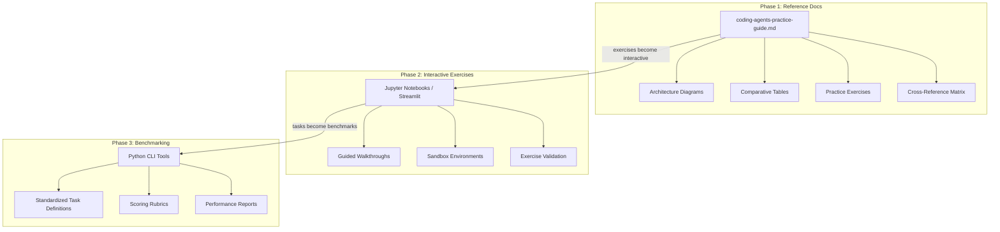
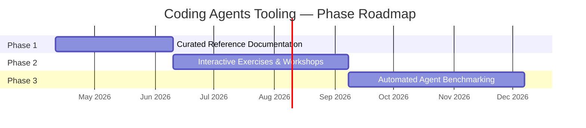
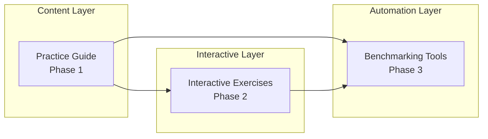

# Coding Agents Tooling — Master Plan

## 1. Vision & Goals

Build a comprehensive reference and practice ecosystem for mastering coding agents — specifically Claude Code (Anthropic) and Codex CLI (OpenAI). The project progresses from curated documentation through interactive exercises to automated benchmarking.

**Target audience**: Senior engineers who use coding agents in daily workflows and want deep mastery of every feature surface — not beginners learning what an LLM is.

**Core principle**: Accuracy over coverage. Every documented feature must be verifiable. Comparative analysis must be fair to both platforms.

---

## 2. Architecture Overview

---

## 3. Phase Roadmap

---

## 4. Phase 1 — Curated Reference Documentation

**Goal**: A single, comprehensive markdown document covering every documented feature of both agents with comparative analysis and applied exercises.

**Deliverable**: `coding-agents-practice-guide.md`

### Content Sections (27 total)

| # | Section | Status |
|---|---------|--------|
| 1 | Architecture Overview | Draft |
| 2 | Installation & Authentication | Draft |
| 3 | CLI Commands & Flags | Draft |
| 4 | Interactive Mode & TUI | Draft |
| 5 | Slash Commands | Draft |
| 6 | Permission & Approval Modes | Draft |
| 7 | Instruction Files (CLAUDE.md vs AGENTS.md) | Draft |
| 8 | Skills | Draft |
| 9 | Hooks | Draft |
| 10 | Plugins | Draft |
| 11 | MCP (Model Context Protocol) | Draft |
| 12 | Subagents & Agent Teams | Draft |
| 13 | Non-Interactive / Headless Mode | Draft |
| 14 | Sandboxing & Security | Draft |
| 15 | Configuration Files | Draft |
| 16 | IDE & Editor Integration | Draft |
| 17 | CI/CD & GitHub Actions | Draft |
| 18 | Cloud & Web Surfaces | Draft |
| 19 | Scheduling & Automation | Draft |
| 20 | Models & Effort Levels | Draft |
| 21 | Context Window Management | Draft |
| 22 | Checkpointing & Session Management | Draft |
| 23 | Agent SDK | Draft |
| 24 | Channels & External Events | Draft |
| 25 | Enterprise & Governance | Draft |
| 26 | Practice Exercises | Draft |
| 27 | Cross-Reference Matrix | Draft |

### Acceptance Criteria
- All 27 sections have substantive content (no stubs)
- Every section includes a comparative table (Claude Code vs Codex CLI)
- Every section includes at least one applied exercise
- All Mermaid diagrams render correctly
- Cross-reference matrix is complete
- Content verified against official documentation

### Content Quality Gates
1. **Verifiability** — every feature claim traceable to official docs or `--help` output
2. **Fairness** — comparative tables present actual capabilities without editorial bias
3. **Completeness** — no "TBD" stubs, no empty rows in tables
4. **Diagrams** — Mermaid diagrams for every architectural or flow concept

---

## 5. Phase 2 — Interactive Exercises & Workshops (Planned)

**Goal**: Transform the static exercises from Phase 1 into guided, interactive experiences.

**Possible implementations** (decision deferred to Phase 2 start):
- Jupyter notebooks with step-by-step cells
- Streamlit app with exercise runner and validation
- Both (notebooks for self-paced, Streamlit for workshop delivery)

**Prerequisites**: Phase 1 complete.

### Candidate Exercise Categories
- Hook authoring and debugging
- Skill creation and testing
- MCP server integration
- Custom slash command workflows
- CI/CD pipeline configuration
- Multi-agent orchestration patterns
- Security and sandboxing configuration

### Tech Stack (tentative)
- Python 3.11+, uv
- Jupyter or Streamlit (or both)
- Docker + docker-compose for sandboxed exercise environments
- pytest for exercise validation

---

## 6. Phase 3 — Automated Agent Benchmarking (Planned)

**Goal**: Python CLI tools that run standardized tasks on both agents and produce comparable performance reports.

**Prerequisites**: Phase 2 complete.

### Candidate Benchmark Dimensions
- Task completion accuracy
- Code quality of generated output
- Tool usage efficiency (number of tool calls per task)
- Context window utilization
- Error recovery behavior
- Time to completion

### Tech Stack (tentative)
- Python 3.11+, FastAPI (for report API), uv
- Docker (sandboxed execution environments)
- Scoring rubrics as Pydantic models
- Results stored as structured JSON or in Postgres

---

## 7. Cross-Phase Concerns

### Accuracy Contract
Content accuracy is the project's primary quality metric across all phases. Every feature claim, CLI flag, configuration option, and behavioral description must be verifiable. This contract does not relax in later phases — interactive exercises and benchmarks inherit the same accuracy requirement.

### Agent Coverage
Both Claude Code and Codex CLI must receive equal treatment. If a feature exists on one agent but not the other, document the gap factually. Never editorialize about which agent is "better."

### Content Evolution
- Phase 1 content (the guide) remains the authoritative reference in all phases
- Phase 2 exercises link back to guide sections, not duplicate them
- Phase 3 benchmarks reference guide sections for methodology context

---

## 8. Module Dependency Diagram

---

## 9. Decision Log

| Date | Decision | Reasoning |
|------|----------|-----------|
| 2026-04-11 | Single markdown file for Phase 1 | Maximizes portability and readability; no build tooling needed |
| 2026-04-13 | Project scaffolding with CLAUDE.md, docs/, commands, skills | Align with standard project structure for multi-session continuity |
| 2026-04-13 | Defer Docker/launcher until Phase 2 | No executable code in Phase 1; launcher adds no value to a docs project |